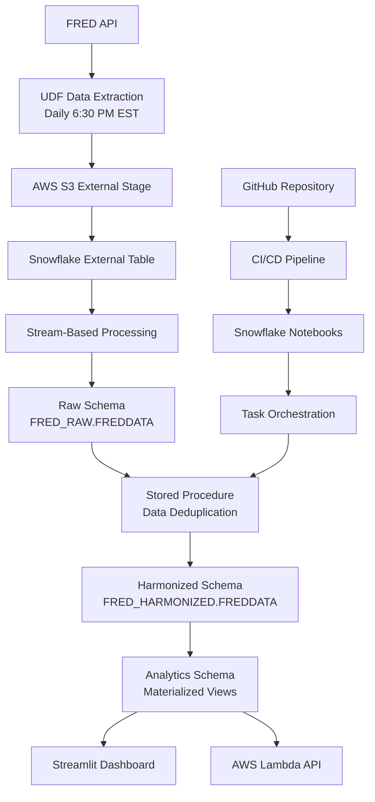

# FRED Economic Data Pipeline — Modern Data Engineering Platform

A comprehensive **data engineering platform** that orchestrates the complete lifecycle of Federal Reserve Economic Data (FRED) ingestion, processing, and analytics. This production-ready system demonstrates modern data engineering practices with Snowflake as the core data warehouse, automated CI/CD pipelines, and real-time streaming analytics.

**Live Applications:**
- **Analytics Dashboard:** [https://treasury-spread.streamlit.app/](https://treasury-spread.streamlit.app/)
- **API Endpoint:** [https://culio1s6lj.execute-api.us-east-1.amazonaws.com/fred_stage/fred](https://culio1s6lj.execute-api.us-east-1.amazonaws.com/fred_stage/fred)

## 🏗️ Architecture Overview


### Data Flow Architecture



## 🚀 Key Data Engineering Features

### Modern Data Architecture
- **Medallion Architecture**: Raw → Harmonized → Analytics data layers
- **Stream Processing**: Real-time incremental data processing with Snowflake Streams
- **Change Data Capture**: Automated detection and processing of new data arrivals
- **Materialized Views**: Pre-computed analytics for sub-second query performance

### Production-Grade Infrastructure
- **Infrastructure as Code**: Complete environment provisioning through SQL scripts
- **Multi-Environment Support**: Separate DEV/PROD environments with parameterized deployments
- **Automated Testing**: Comprehensive data quality and pipeline validation
- **Monitoring & Alerting**: Built-in pipeline health checks and SLA monitoring

### Cloud-Native Integration
- **Multi-Cloud Strategy**: AWS Lambda + S3, GCP Storage, Snowflake Data Cloud
- **Serverless Computing**: Event-driven processing with AWS Lambda functions
- **API-First Design**: RESTful APIs for data access and integration
- **Auto-Scaling**: Compute resources that scale with data volume

## 📁 Project Structure

```
bigdata-org-fred_data_extraction/
├── frontend/                           # Analytics Dashboard
│   ├── streamlit-app.py               # Interactive data visualization
│   └── requirements.txt
├── lambda/                            # Serverless API Layer
│   ├── lambda_function.py            # AWS Lambda handler
│   ├── connector.py                  # Snowflake connection management
│   └── requirements.txt
├── notebooks/                         # Data Processing Logic
│   ├── DB_OBJECTS/                   # Schema and object definitions
│   │   ├── DB_OBJECTS.ipynb         # Database infrastructure setup
│   │   └── environment.yml
│   └── LOAD_FROM_STAGE/             # ETL orchestration
│       ├── LOAD_FROM_STAGE.ipynb    # Data loading and transformation
│       └── environment.yml
├── scripts/                          # Infrastructure & Deployment
│   ├── data_env_setup.sql           # Environment provisioning (Jinja templated)
│   ├── deploy_notebooks.sql         # Notebook deployment automation
│   ├── deploy_snowpark_apps.py      # Snowpark application deployment
│   ├── load_raw_data.py            # Historical data backfill utility
│   ├── orchestrate_jobs.sql         # Task scheduling and dependencies
│   ├── procedures/                   # Stored Procedures
│   │   └── fred_data_update/        # Data processing stored procedure
│   │       ├── snowflake.yml
│   │       ├── requirements.txt
│   │       └── fred_data_update_sp/
│   │           └── procedure.py
│   └── udf/                         # User Defined Functions
│       └── calculate_percent_profit_loss/
│           ├── snowflake.yml
│           ├── requirements.txt
│           └── calculate_percent_profit_loss_udf/
│               └── function.py
├── tests/                            # Data Quality & Pipeline Tests
│   ├── test_pipeline_1.py          # Data completeness validation
│   ├── test_pipeline_2.py          # Analytics layer testing
│   ├── sql_sp_test.py              # Stored procedure unit tests
│   └── udf_test.py                 # UDF functionality testing
├── prototyping/                      # Development & Analysis
│   ├── data.csv                    # Sample dataset
│   └── graph.ipynb                 # Data exploration notebook
└── .github/workflows/               # CI/CD Automation
    ├── data_env_setup.yaml         # Environment deployment pipeline
    ├── deploy_changes.yaml         # Application deployment pipeline
    ├── deploy_notebooks.yaml       # Notebook synchronization pipeline
    └── uploadData.yaml             # Data refresh automation
```

## ⚙️ Data Pipeline Components

### 1. Data Ingestion Layer

**FRED API Integration**
- **Source**: Federal Reserve Economic Data (FRED) API
- **Target Series**: T10Y2Y (10-Year Treasury Minus 2-Year Treasury)
- **Frequency**: Daily extraction at 6:30 PM EST
- **Method**: Snowflake User-Defined Function (UDF) with external API integration

**Key Features:**
```sql
-- UDF for automated data extraction
CREATE OR REPLACE FUNCTION fredapi_response_to_df(api_url STRING)
RETURNS INTEGER
LANGUAGE PYTHON
EXTERNAL_ACCESS_INTEGRATIONS = (FREDAPI_EXT_ACCESS_INT, S3_EXT_ACCESS_INT)
PACKAGES = ('requests', 'pandas', 'boto3')
```

### 2. Stream Processing Architecture

**Real-Time Data Processing**
```sql
-- Stream for incremental processing
CREATE OR REPLACE STREAM FREDDATA_STREAM 
ON TABLE FRED_RAW.FREDDATA;

-- Automated task with stream condition
CREATE OR REPLACE TASK DATA_UPDATE_TASK
WAREHOUSE = FRED_WH
WHEN SYSTEM$STREAM_HAS_DATA('FRED_RAW.FREDDATA_STREAM')
AS EXECUTE NOTEBOOK LOAD_FROM_STAGE();
```

**Stream Processing Benefits:**
- **Incremental Processing**: Only processes new/changed data
- **Cost Optimization**: Reduces compute costs by avoiding full table scans
- **Real-Time Analytics**: Sub-minute latency for new data availability
- **Automatic Deduplication**: Handles duplicate records gracefully

### 3. Data Transformation Pipeline

**Multi-Layer Architecture:**

**Raw Layer (`FRED_RAW`)**
- Stores data exactly as received from FRED API
- Preserves original data types and formats
- Includes metadata for lineage tracking

**Harmonized Layer (`FRED_HARMONIZED`)**
- Cleaned and standardized data
- Applied business rules and validations
- Comprehensive audit trail with timestamps

**Analytics Layer (`FRED_ANALYTICS`)**
- Pre-computed aggregations and metrics
- Materialized views for performance optimization
- Multiple analytical perspectives (daily, monthly, yearly)

### 4. Advanced Analytics Features

**Pre-Built Analytics Views:**
```sql
-- Year-over-year analysis
CREATE OR REPLACE VIEW year_wise_analytics AS
SELECT 
    YEAR(data_date) AS year, 
    TRUNC(AVG(value), 2) AS average_value 
FROM freddata 
GROUP BY YEAR(data_date);

-- Month-wise trend analysis
CREATE OR REPLACE VIEW month_wise_analytics AS
SELECT 
    YEAR(data_date) AS year,
    MONTHNAME(data_date) AS month,
    TRUNC(AVG(value), 2) AS average_value
FROM freddata
GROUP BY YEAR(data_date), MONTH(data_date), MONTHNAME(data_date);

-- Day-over-day comparison with percentage change
CREATE OR REPLACE VIEW curr_vs_prev_analytics AS
SELECT 
    data_date,
    value AS current_value,
    LAG(value) OVER (ORDER BY data_date) AS previous_day_value,
    CALCULATE_PERCENT_PROFIT_LOSS(current_value, previous_day_value) AS percent_difference
FROM freddata;
```

## 🔧 Infrastructure Setup

### Prerequisites

- **Snowflake Account** with appropriate privileges
- **AWS Account** with S3 and Lambda access
- **GitHub Repository** with Actions enabled
- **Python 3.10+** for local development

### Environment Configuration

**Snowflake Setup Variables:**
```bash
# Core Snowflake Configuration
SNOWFLAKE_ACCOUNT=your-account-identifier
SNOWFLAKE_USER=your-username
SNOWFLAKE_PASSWORD=your-password
SNOWFLAKE_ROLE=FRED_ROLE
SNOWFLAKE_WAREHOUSE=FRED_WH
SNOWFLAKE_DATABASE=FRED_DB

# AWS Integration
AWS_ACCESS_KEY=your-aws-access-key
AWS_SECRET_ACCESS_KEY=your-aws-secret-key
AWS_REGION=us-east-1

# FRED API
FRED_API_KEY=your-fred-api-key

# GitHub Integration
GITHUB_SECRET_USERNAME=your-github-username
GITHUB_SECRET_PASSWORD=your-github-token
```

### Deployment Options

#### Option 1: Automated CI/CD Deployment

**1. Initial Environment Setup**
```bash
# Trigger environment provisioning
git push origin deploy
```

**2. Application Deployment**
```bash
# Deploy notebooks and stored procedures
git push origin main
```

**3. Data Pipeline Activation**
```bash
# Manual trigger for historical data load
# Access GitHub Actions → Run "Update Data" workflow
```

#### Option 2: Manual Local Deployment

**1. Infrastructure Setup**
```bash
# Install dependencies
pip install -r requirements.txt

# Deploy core infrastructure
snow sql -f scripts/pre_deployment_script_1.sql
snow sql -f scripts/pre_deployment_script_2.sql

# Setup data environment
snow sql -q "EXECUTE IMMEDIATE FROM @GIT_REPO/branches/main/scripts/data_env_setup.sql 
  USING (env => 'PROD', AWS_ACCESS_KEY => 'your-key', AWS_SECRET_ACCESS_KEY => 'your-secret')"
```

**2. Snowpark Applications**
```bash
# Deploy UDFs and Stored Procedures
python scripts/deploy_snowpark_apps.py ./scripts
```

**3. Historical Data Load**
```bash
# Backfill historical data
python scripts/load_raw_data.py
```

## 📊 Analytics & Visualization

### Streamlit Dashboard Features

**Interactive Visualizations:**
- **Time Series Analysis**: Interactive Plotly charts with zoom and pan
- **Drill-Down Capabilities**: Year → Month → Day granularity
- **Real-Time Updates**: Automatic refresh with latest data
- **Statistical Analysis**: Moving averages, volatility metrics, correlations

**Key Metrics Displayed:**
- **Treasury Spread Trends**: 10Y-2Y yield curve analysis
- **Historical Context**: Multi-year trend analysis
- **Economic Indicators**: Recession probability indicators
- **Statistical Insights**: Volatility measures and distribution analysis

### API Integration

**RESTful Data Access:**
```python
# Python client example
import requests

# Fetch latest analytics
response = requests.get(
    'https://culio1s6lj.execute-api.us-east-1.amazonaws.com/fred_stage/fred'
)

data = response.json()
monthly_analytics = data['body'][0]  # Month-wise data
yearly_analytics = data['body'][1]   # Year-wise data
daily_comparison = data['body'][2]   # Day-over-day analysis
```

**API Response Structure:**
```json
{
  "statusCode": 200,
  "body": [
    // Monthly aggregated data
    [{"year": 2024, "month": "January", "average_value": 0.35}],
    
    // Yearly aggregated data  
    [{"year": 2024, "average_value": 0.28}],
    
    // Daily comparison data
    [{"date": "2024-12-31", "current_value": 0.33, "previous_day_value": 0.31, "percent_difference": "6.45 %"}]
  ]
}
```

## 🧪 Data Quality & Testing

### Automated Testing Framework

**Pipeline Validation Tests:**
```python
# Data completeness validation
def test_data_completeness():
    expected_weekdays = count_weekdays('2020-02-23', date.today())
    actual_records = session.sql(
        "SELECT COUNT(*) FROM FRED_HARMONIZED.FREDDATA"
    ).collect()[0][0]
    
    assert expected_weekdays == actual_records

# UDF functionality testing  
def test_percent_calculation():
    result = session.sql(
        "SELECT CALCULATE_PERCENT_PROFIT_LOSS(100, 50)"
    ).collect()[0][0]
    
    assert result == -50.0  # 50% decrease
```

**Data Quality Checks:**
- **Completeness**: Verify no missing weekdays in dataset
- **Accuracy**: Validate mathematical calculations and transformations
- **Consistency**: Ensure data types and formats across all layers
- **Timeliness**: Monitor data freshness and SLA compliance

### Performance Monitoring

**Key Performance Indicators:**
- **Data Latency**: API extraction to dashboard availability
- **Query Performance**: Analytics view response times
- **Pipeline Success Rate**: ETL job completion metrics
- **Cost Optimization**: Compute and storage cost tracking

## 🔄 Operational Procedures

### Daily Operations

**Automated Processes:**
- **6:30 PM EST**: FRED API data extraction via scheduled UDF
- **6:45 PM EST**: Stream processing triggers data harmonization
- **7:00 PM EST**: Analytics materialized views refresh
- **7:15 PM EST**: Dashboard and API data availability

**Monitoring Checkpoints:**
- Stream health and backlog monitoring
- Task execution success rates
- Data quality validation results
- API endpoint response time tracking

### Error Handling & Recovery

**Resilience Features:**
- **Retry Logic**: Automatic retry for transient failures
- **Dead Letter Queues**: Failed record isolation and manual review
- **Circuit Breakers**: Automatic service degradation protection
- **Rollback Procedures**: Quick recovery to last known good state

**Alerting Mechanisms:**
- **Data SLA Violations**: Alert on delayed data delivery
- **Pipeline Failures**: Immediate notification on job failures
- **Quality Thresholds**: Warning on data quality degradation
- **Resource Utilization**: Monitoring for cost anomalies

## 🎯 Use Cases & Business Value

### Financial Analytics
- **Yield Curve Analysis**: Track interest rate environment changes
- **Economic Forecasting**: Input for recession probability models
- **Risk Management**: Portfolio duration and interest rate sensitivity
- **Investment Strategy**: Market timing and allocation decisions

### Data Engineering Showcase
- **Modern Architecture**: Demonstrates cloud-native data engineering patterns
- **Streaming Analytics**: Real-time processing with minimal latency
- **Infrastructure as Code**: Reproducible, version-controlled deployments
- **Cost Optimization**: Efficient resource utilization with auto-scaling

### Educational Applications
- **Data Engineering Training**: Complete end-to-end pipeline example
- **Financial Data Analysis**: Hands-on experience with economic datasets
- **Cloud Platform Integration**: Multi-cloud architecture patterns
- **DevOps Best Practices**: CI/CD for data applications

## 🔧 Troubleshooting Guide

### Common Issues

**Stream Processing Delays**
```sql
-- Check stream status
SHOW STREAMS LIKE 'FREDDATA_STREAM';

-- Verify stream has data
SELECT SYSTEM$STREAM_HAS_DATA('FRED_RAW.FREDDATA_STREAM');

-- Manual stream reset if needed
CREATE OR REPLACE STREAM FREDDATA_STREAM ON TABLE FRED_RAW.FREDDATA;
```

**Task Execution Failures**
```sql
-- Check task history
SELECT * FROM TABLE(INFORMATION_SCHEMA.TASK_HISTORY()) 
WHERE NAME = 'DATA_UPDATE_TASK'
ORDER BY SCHEDULED_TIME DESC;

-- Resume suspended task
ALTER TASK DATA_UPDATE_TASK RESUME;
```

**API Integration Issues**
```sql
-- Test UDF connectivity
SELECT FREDAPI_RESPONSE_TO_DF(
  'https://api.stlouisfed.org/fred/series/observations?series_id=T10Y2Y&api_key=your-key&file_type=json'
);

-- Verify external access integration
SHOW EXTERNAL ACCESS INTEGRATIONS;
```

**Data Quality Issues**
```sql
-- Check for data gaps
SELECT data_date, 
       LAG(data_date) OVER (ORDER BY data_date) AS prev_date,
       DATEDIFF(day, prev_date, data_date) AS gap_days
FROM FRED_HARMONIZED.FREDDATA 
WHERE gap_days > 3;  -- Weekends = 3 days max

-- Validate data ranges
SELECT MIN(value), MAX(value), AVG(value), STDDEV(value)
FROM FRED_HARMONIZED.FREDDATA
WHERE data_date >= CURRENT_DATE - 30;
```

## 📈 Performance Optimization

### Query Optimization
- **Materialized Views**: Pre-computed aggregations for sub-second response
- **Result Caching**: Automatic query result caching for repeated patterns
- **Clustering Keys**: Optimal data organization for time-series queries
- **Zero-Copy Cloning**: Efficient dev/test environment provisioning

### Cost Management
- **Auto-Suspend Warehouses**: Automatic compute shutdown during idle periods
- **Right-Sized Compute**: Appropriate warehouse sizing for workload demands
- **Storage Optimization**: Time-travel and fail-safe configuration tuning
- **Monitoring & Alerts**: Proactive cost anomaly detection

---

**Built for Modern Data Engineering Excellence** 📊

*This project demonstrates production-ready data engineering practices, combining the reliability of traditional data warehousing with the agility of modern cloud-native architecture. Perfect for showcasing advanced Snowflake capabilities, streaming data processing, and comprehensive data pipeline automation.*
